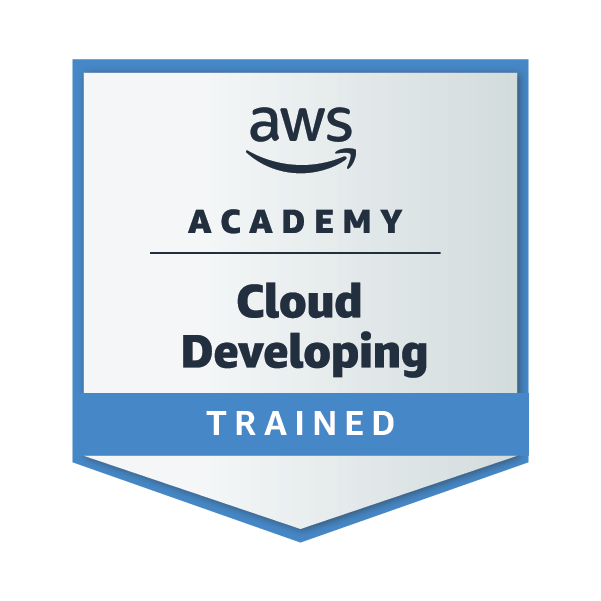
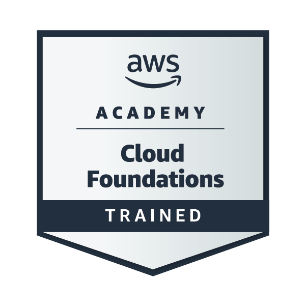
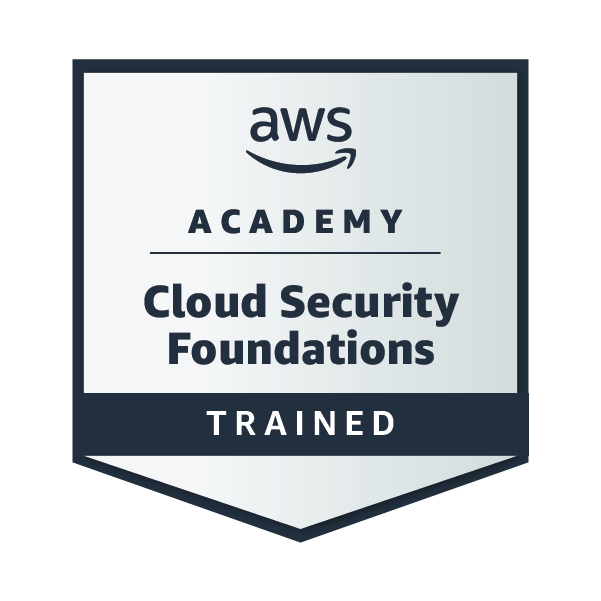
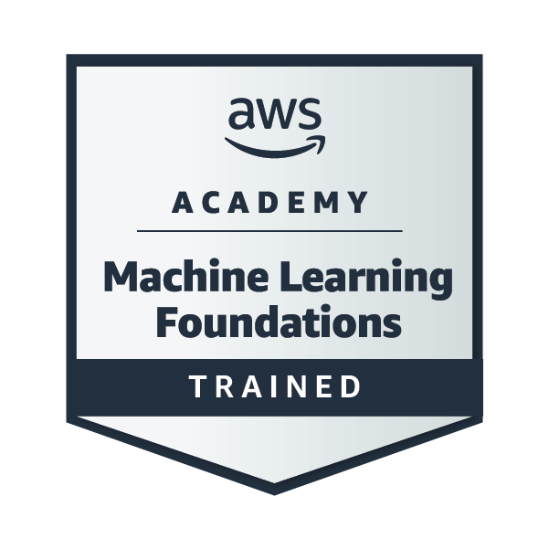

## 🌿 Saudações, Guardião das Linhas Ocultas! 🐾🖥️

  

### **Pedro Lucas, o Sábio Druid dos Caminhos do Código...** 🍃🔮

---

### 🧠 Sobre mim

Sou um desenvolvedor backend em formação, com foco na criação de APIs, manipulação de dados e boas práticas de desenvolvimento.
Tenho interesse em aprender novas tecnologias e construir soluções eficientes e bem estruturadas.

---

<ul style="list-style: none; padding: 0; margin: 0; line-height: 1.8;">  
  <li>🌲 Mestre dos Segredos do Backend — onde dados brotam como raízes profundas</li>  
  <li>🍃 Portador dos Tomos Sagrados de JavaScript, Python, C e Java</li>  
  <li>🦉 Guardião dos fluxos de dados e mestre na arte da lógica computacional</li>  
  <li>📚 Explorador incansável de boas práticas, clean code e arquitetura de software</li>  
  <li>⚙️ Forjado nas florestas de microserviços e bancos de dados como MySQL e MongoDB</li>  
  <li>🔮 Invocador de APIs robustas, eficientes e bem estruturadas</li>  
</ul>  

---

### 📊 Poder Arcano do Guardião

  
  &nbsp;&nbsp;&nbsp;
  

---

### 🏅 Insígnias do Guardião

  

  

  

  

  

---

### ⚡ Skills em Destaque

  
    
    
    

  

---

### 🔮 Linguagens e Tecnologias

  
    

  

---

### 🛠️ Ferramentas do Guardião

  
    

  

---

### 🚀 Projetos do Guardião

🍽️ **Nhambu API**
*API REST para gerenciamento de pratos de um restaurante paraense.*

* ✔ Cadastro de pratos
* ✔ Listagem de pratos
* ✔ Atualização de registros
* ✔ Remoção de dados
* ✔ MongoDB Atlas
* ✔ Testes com Insomnia
* ✔ Documentação da API

---

### 🛡️ Habilidades do Guardião

* Desenvolvimento de APIs REST
* Operações CRUD
* Modelagem de dados
* Integração com banco de dados
* Testes de endpoints com Insomnia
* Estruturação de backend

---

### 🍽️ Criação em Andamento — O Reino de Nhambu

Atualmente estou forjando uma **API REST com MongoDB** para o restaurante paraense **Nhambu**, um sistema voltado ao gerenciamento de pratos e registros do cardápio.
Nessa jornada, aplico operações de **CRUD** para cadastrar, listar, atualizar e remover informações, fortalecendo meus conhecimentos em backend, modelagem de dados e estruturação de rotas.

O projeto também envolve **documentação da API**, testes com **Insomnia**, banco em nuvem com **MongoDB Atlas** e a criação de um **protótipo frontend no Figma** para representar a experiência de uso do sistema.

---

### ✨ Magias do Protetor dos Servidores

* 🍄 `CleanSpellAura()` → Código limpo, modular e de fácil manutenção
* 🌌 `SummonDatabaseEntity()` → Modelagem e persistência de dados
* 🔥 `ForgeMicroservice()` → Criação de APIs e serviços escaláveis

---

### 🌐 Contato

  
  

---

> *“A sabedoria pulsa como seiva nas raízes do código; cada API é uma vida canalizada com propósito.”*
> — Pedro Lucas, Protetor dos Fluxos de Dados 🌳🧙‍♂️
